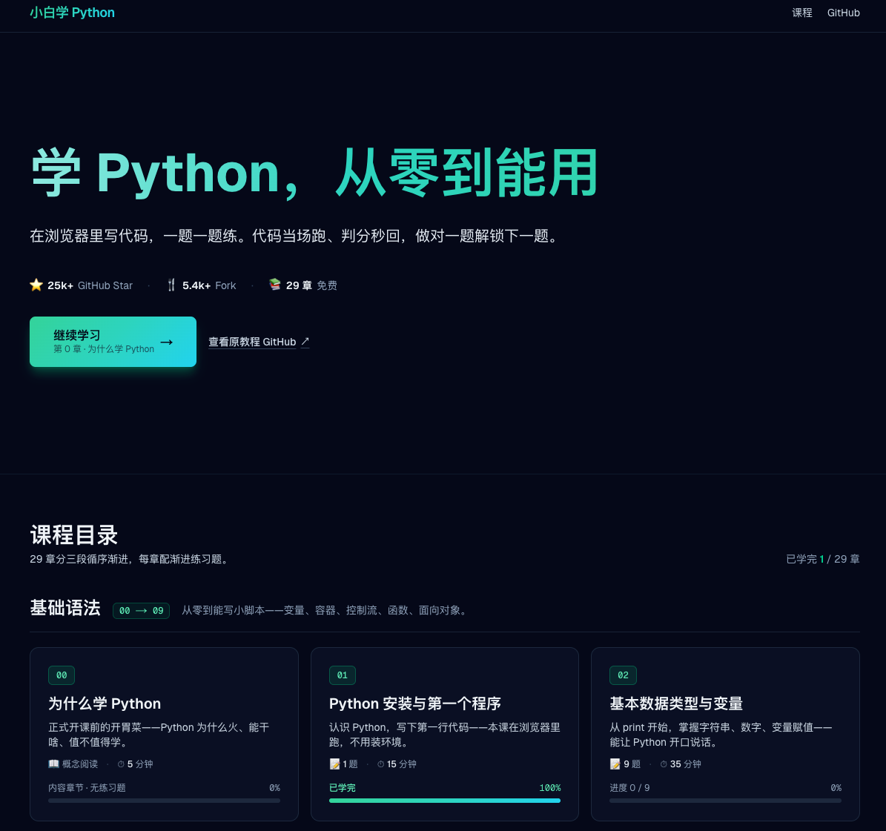
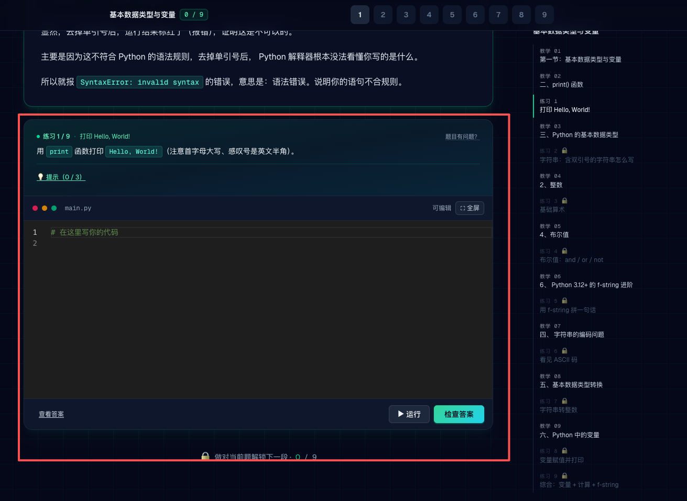

IT 行业相对于一般传统行业，发展更新速度更快，一旦停止了学习，很快就会被行业所淘汰，但是，我们要清楚：淘汰的永远只是那些初级水平的从业者，过硬技术的从业者永远都是稀缺的。因此对于学习，我们还是要踏踏实实的。

自学 Python ，也是一样，不要一开始因为头脑发热就不停地收藏各种资料网站，购买各种书籍，下载了大量的教学视频，过了几天，学习的热情开始褪去，再过几个星期，终于完成了学习课程 —— 《从入门到放弃》。所以，学习 Python 需要一步一个脚印，踏踏实实地学。

> 本教程基于 Python 3.10+ 编写，部分章节标注了 3.11/3.12/3.13 的新特性。在线站点：[https://walter201230.github.io/Python/](https://walter201230.github.io/Python/)

# 2026 更新说明

2026 年是 AI 编程的普及年，在这一年，我深切感受到 AI 编程的强大，以前我们手敲代码的年代估计一去不复返，现在手敲代码还被互联网称为古法编程，短短几年，变化如此的快，我是完全没想到的。

AI 时代，我以为这个课程不会再有人看了，但没想到这个教程依然每天保持着稳定的增长，于是我用 AI 把我这个项目全面更新了一下。

更新完了全部教程内容之后，我用 AI 做了一个网站，更方便大家学习，不过为了省成本，我这个是静态网站，该有的功能都有，该有的体验也有，只是没法做到跨设备保存你学习的记录而已。

这个网站的地址是：https://python-lab-9qf.pages.dev/

这是一个升级打怪学习 Python 基础知识的网站，你在浏览器里就可以写代码，一题一题练。代码当场跑、判分秒回，做对一题解锁下一题。截几张图给大家感受下：

首页：会记录你的学习进度

课程内容：每学完一个知识点，会有练习题，你可以在线写代码，提交代码，正确了就解锁下一部分的教程内容

对于初学者来说，体验一定非常的好。快去试试吧。也欢迎推荐给你的朋友。

# Python 入门

对于入门，主要是掌握基本的语法和熟悉编程规范，因此大部分的教程基本一致的，所以还是建议选好适合自己的一个教程，坚持学下去。

**主要目录如下：**

* [为什么学Python?](/Article/PythonBasis/python0/WhyStudyPython.md)
* [Python代码规范](/Article/codeSpecification/codeSpecification_Preface.md)
  - [简明概述](/Article/codeSpecification/codeSpecification_first.md)
  - [注释](/Article/codeSpecification/codeSpecification_second.md)
  - [命名规范](/Article/codeSpecification/codeSpecification_third.md)
* [第一个Python程序](/Article/PythonBasis/python1/Preface.md)
  - [Python 简介](/Article/PythonBasis/python1/Introduction.md)
  - [Python 的安装](/Article/PythonBasis/python1/Installation.md)
  - [第一个 Python 程序](/Article/PythonBasis/python1/The_first_procedure.md)
  - [集成开发环境（IDE）: PyCharm](/Article/PythonBasis/python1/IDE.md)
* [基本数据类型和变量](/Article/PythonBasis/python2/Preface.md)
  - [Python 语法的简要说明](/Article/PythonBasis/python2/Grammar.md)
  - [print() 函数](/Article/PythonBasis/python2/print.md)
  - [Python 的基本数据类型](/Article/PythonBasis/python2/Type_of_data.md)
  - [字符串的编码问题](/Article/PythonBasis/python2/StringCoding.md)
  - [基本数据类型转换](/Article/PythonBasis/python2/Type_conversion.md)
  - [Python 中的变量](/Article/PythonBasis/python2/Variable.md)
* [List 和 Tuple](/Article/PythonBasis/python3/Preface.md)
  - [List（列表）](/Article/PythonBasis/python3/List.md)
  - [tuple（元组）](/Article/PythonBasis/python3/tuple.md)
* [ Dict 和 Set](/Article/PythonBasis/python4/Preface.md)
  - [字典(Dictionary)](/Article/PythonBasis/python4/Dict.md)
  - [set](/Article/PythonBasis/python4/Set.md)
* [条件语句和循环语句](/Article/PythonBasis/python5/Preface.md)
  - [条件语句](/Article/PythonBasis/python5/If.md)
  - [循环语句](/Article/PythonBasis/python5/Cycle.md)
  - [条件语句和循环语句综合实例](/Article/PythonBasis/python5/Example.md)
* [函数](/Article/PythonBasis/python6/Preface.md)
  - [Python 自定义函数的基本步骤](/Article/PythonBasis/python6/1.md)
  - [函数返回值](/Article/PythonBasis/python6/2.md)
  - [函数的参数](/Article/PythonBasis/python6/3.md)
  - [函数传值问题](/Article/PythonBasis/python6/4.md)
  - [匿名函数](/Article/PythonBasis/python6/5.md)
* [迭代器和生成器](/Article/PythonBasis/python7/Preface.md)
  - [迭代](/Article/PythonBasis/python7/1.md)
  - [Python 迭代器](/Article/PythonBasis/python7/2.md)
  - [list 生成式（列表生成式）](/Article/PythonBasis/python7/3.md)
  - [生成器](/Article/PythonBasis/python7/4.md)
  - [迭代器和生成器综合例子](/Article/PythonBasis/python7/5.md)
* [面向对象](/Article/PythonBasis/python8/Preface.md)
  - [面向对象的概念](/Article/PythonBasis/python8/1.md)
  - [类的定义和调用](/Article/PythonBasis/python8/2.md)
  - [类方法](/Article/PythonBasis/python8/3.md)
  - [修改和增加类属性](/Article/PythonBasis/python8/4.md)
  - [类和对象](/Article/PythonBasis/python8/5.md)
  - [初始化函数](/Article/PythonBasis/python8/6.md)
  - [类的继承](/Article/PythonBasis/python8/7.md)
  - [类的多态](/Article/PythonBasis/python8/8.md)
  - [类的访问控制](/Article/PythonBasis/python8/9.md)
* [模块与包](/Article/PythonBasis/python9/Preface.md)
  - [Python 模块简介](/Article/PythonBasis/python9/1.md)
  - [模块的使用](/Article/PythonBasis/python9/2.md)
  - [主模块和非主模块](/Article/PythonBasis/python9/3.md)
  - [包](/Article/PythonBasis/python9/4.md)
  - [作用域](/Article/PythonBasis/python9/5.md)
* [Python 的 Magic Method](/Article/PythonBasis/python10/Preface.md)
  - [Python 的 Magic Method](/Article/PythonBasis/python10/1.md)
  - [构造(`__new__`)和初始化(`__init__`)](/Article/PythonBasis/python10/2.md)
  - [属性的访问控制](/Article/PythonBasis/python10/3.md)
  - [对象的描述器](/Article/PythonBasis/python10/4.md)
  - [自定义容器（Container）](/Article/PythonBasis/python10/5.md)
  - [运算符相关的魔术方法](/Article/PythonBasis/python10/6.md)
* [枚举类](/Article/python11/PythonBasis/Preface.md)
  - [枚举类的使用](/Article/PythonBasis/python11/1.md)
  - [Enum 的源码](/Article/PythonBasis/python11/2.md)
  - [自定义类型的枚举](/Article/PythonBasis/python11/3.md)
  - [枚举的比较](/Article/PythonBasis/python11/4.md)
* [元类](/Article/PythonBasis/python12/Preface.md)
  - [Python 中类也是对象](/Article/PythonBasis/python12/1.md)
  - [使用 `type()` 动态创建类](/Article/PythonBasis/python12/2.md)
  - [什么是元类](/Article/PythonBasis/python12/3.md)
  - [自定义元类](/Article/PythonBasis/python12/4.md)
  - [使用元类](/Article/PythonBasis/python12/5.md)
* [线程与进程](/Article/PythonBasis/python13/Preface.md)
  - [线程与进程](/Article/PythonBasis/python13/1.md)
  - [多线程编程](/Article/PythonBasis/python13/2.md)
  - [进程](/Article/PythonBasis/python13/3.md)
* [一步一步了解正则表达式](/Article/PythonBasis/python14/Preface.md)
    - [初识 Python 正则表达式](/Article/PythonBasis/python14/1.md)
    - [字符集](/Article/PythonBasis/python14/2.md)
    - [数量词](/Article/PythonBasis/python14/3.md)
    - [边界匹配符和组](/Article/PythonBasis/python14/4.md)
    - [re.sub](/Article/PythonBasis/python14/5.md)
    - [re.match 和 re.search](/Article/PythonBasis/python14/6.md)
* [闭包](/Article/PythonBasis/python15/1.md)
* [装饰器](/Article/PythonBasis/python16/1.md)
* [类型注解](/Article/PythonBasis/python17/1.md)
* [pathlib 路径处理](/Article/PythonBasis/python18/1.md)
* [异常处理与异常组](/Article/PythonBasis/python19/1.md)
* [dataclass 与 Pydantic](/Article/PythonBasis/python20/1.md)
* [上下文管理器](/Article/PythonBasis/python21/1.md)
* [async/await 与并发](/Article/PythonBasis/python22/1.md)
* [工程基线 pyproject 与 uv](/Article/PythonBasis/python23/1.md)
* [代码风格 ruff](/Article/PythonBasis/python24/1.md)
* [单元测试 pytest](/Article/PythonBasis/python25/1.md)
* [标准日志 logging](/Article/PythonBasis/python26/1.md)
* [打包发布与 typer](/Article/PythonBasis/python27/1.md)
* [学完之后做什么](/Article/PythonBasis/python28/1.md)

持续更新....

可以关注我的公众号，实时了解更新情况。

